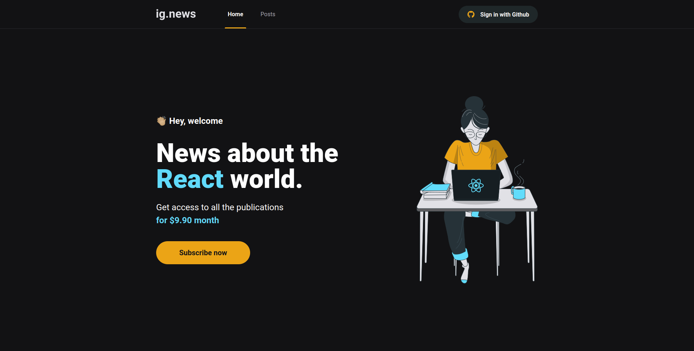
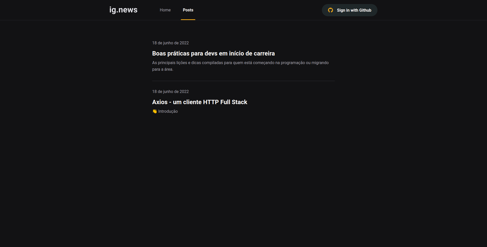
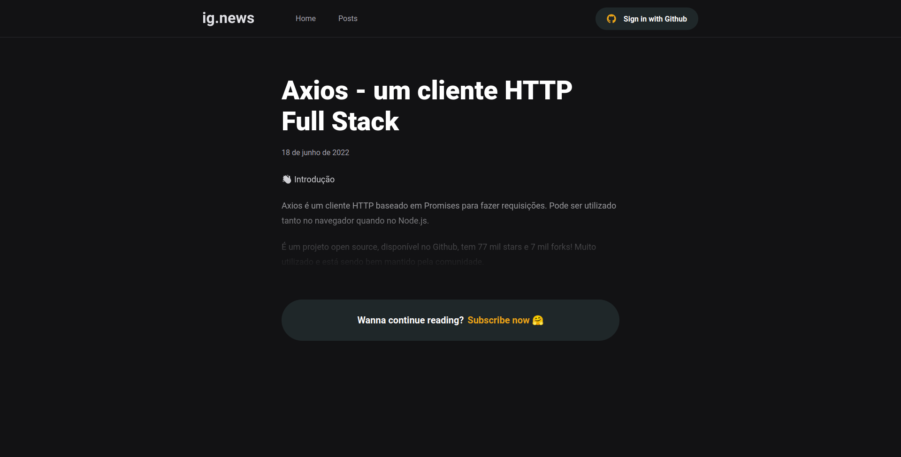
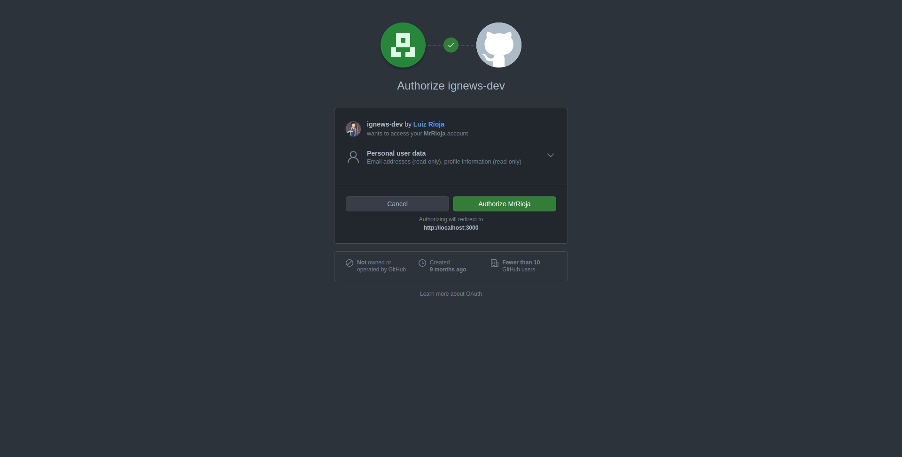
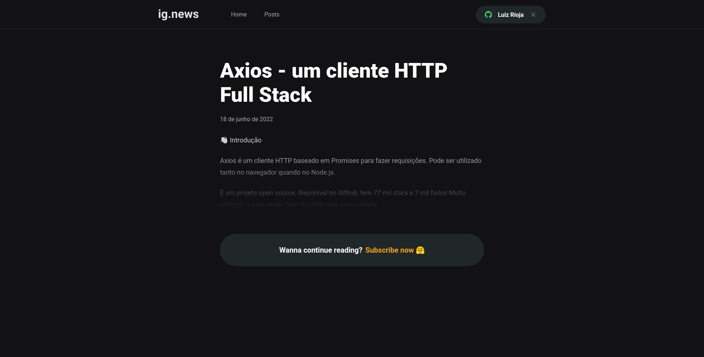
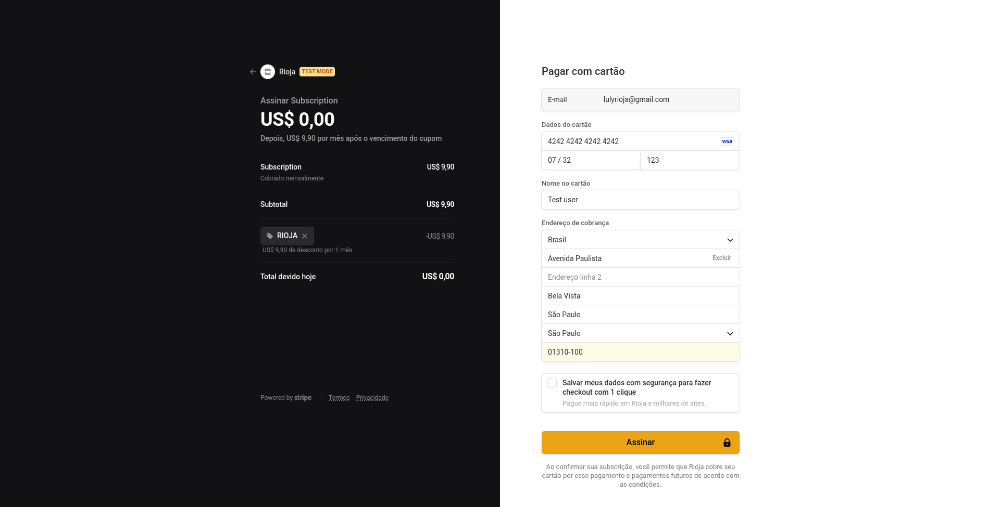
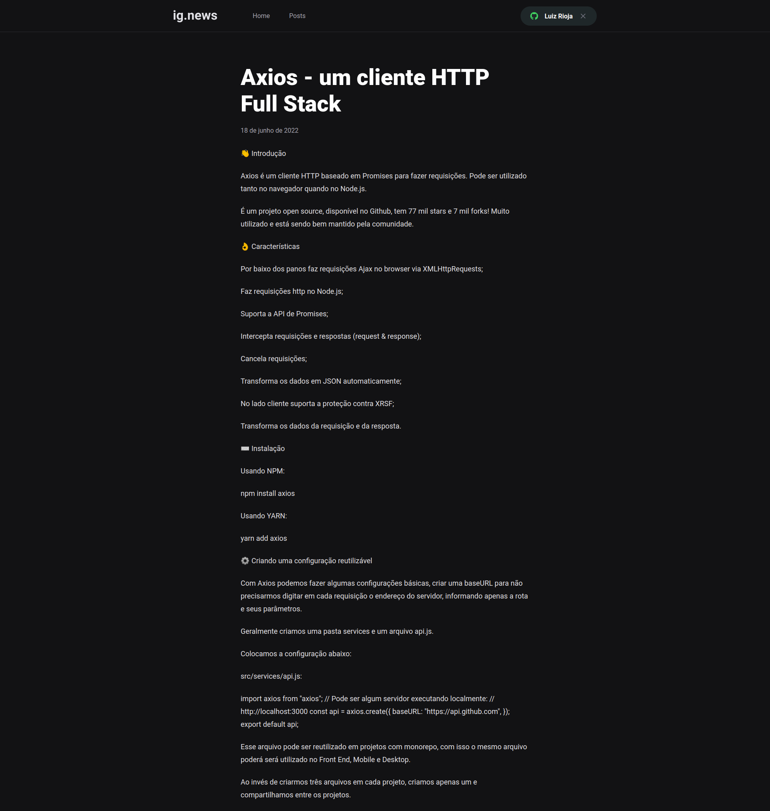
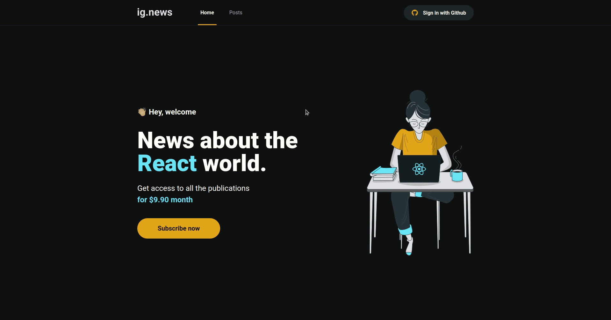

<div align="center">
  
  <br/>
  <br/>

  
  <h5 align="center">
    Informação sem complicação.
  </h5>
</div>

<p align="center">
  
  
  
  
</p>

<p align="center">
  <a href="#sobre">Sobre</a> •
  <a href="#ignews">IgNews</a> •
  <a href="#instalação">Instalação</a> •
  <a href="#tecnologias">Tecnologias</a> •
  <a href="#autor">Autor</a>  
</p>

## Sobre

Projeto desenvolvido durante o Ignite, um bootcamp criado pela [Rocketseat](https://rocketseat.com.br/) com diversas trilhas de variadas tecnologias. O projeto foi criado durante o módulo III do bootcamp na trilha de [ReactJS](https://pt-br.reactjs.org/).

## IgNews

O IgNews é um blog com conteúdo tech construído com NextJS, Prismic CMS e Strip.

Ao acessar a aplicação, o visitante verá a tela abaixo, aonde poderá realizar login, ir para página de posts ou se inscrever no blog:



Ao ir para a página de posts, o usuário verá a lista com todos os posts cadastrados no blog, conforme veremos a seguir, e isso não depende de login ou inscrição no blog pois qualquer usuário poderá ver a lista:



Ao clicar em um post de interesse, o seu conteúdo será exibido parcialmente como ilustra a imagem a seguir. Isso ocorre porque os posts só podem ser exibidos completamente para usuários logados e com inscrições ativas na plataforma:



Ao clicar no botão `Sign in with Github` presente no canto superior direto, o usuário verá a tela a seguir para autorizar a aplicação a ter acesso à algumas informações de seu perfil no Github:



Note que mesmo logado na aplicação o conteúdo ainda é não é exibido por completo, pois o usuário em questão não é inscrito no blog:



Ao clicar no botão de inscrição presente na página de post ou na home do blog, o usuário será direcionado para o checkout do Stripe, conforme imagem abaixo:



Após informar os dados na tela acima e realizar o pagamento da inscrição o usuário já estará apto para ver os posts por completo. Abaixo uma demonstração de um usuário logado e inscrito no blog:



Pronto! 🎉
usuário logado e com inscrição ativa, podendo ver todo conteúdo do blog e livre de limitações.

Para ilustrar todo o fluxo da aplicação, deixo o GIF abaixo navegando pela aplicação desde a estaca zero até o acesso total ao conteúdo do blog:



## Instalação

Antes de começar, você vai precisar ter instalado em sua máquina as seguintes ferramentas:
[Git](https://git-scm.com), [Node.js](https://nodejs.org/en/).
Além disto é bom ter um editor para trabalhar com o código como [VSCode](https://code.visualstudio.com/).

É de suma importância que, antes de executar o projeto, as variáveis de ambiente abaixo tenham sido preenchidas no arquivo `env.local` seguindo o modelo do `env.example`.

Para gerar as secrets e URLs basta acessar cada um dos serviços, criar sua conta e gerar as chaves para preencher no `.env`. As variáveis que iniciam com `NEXTAUTH_` não são obrigatórias para executar a aplicação localmente.
Feito isso, nas seguir com a etapa abaixo para executar o projeto.

### 🖥️ Rodando o Front End (Web)

```bash
# Clone este repositório
$ git clone git@github.com:MrRioja/ignews.git

# Acesse a pasta do projeto no terminal/cmd
$ cd ignews

# Instale as dependências
$ npm install
# Caso prefira usar o Yarn execute o comando abaixo
$ yarn

# Execute a aplicação em modo de desenvolvimento
$ npm run dev
# Caso prefira usar o Yarn execute o comando abaixo
$ yarn dev

# O servidor inciará na porta 3000 - acesse <http://localhost:3000>
```

## Tecnologias


<br><br><br>

## Autor

<div align="center">

<h1>Luiz Rioja</h1>
<strong>Backend Developer</strong>
<br/>
<br/>

<a href="https://linkedin.com/in/luizrioja" target="_blank">

</a>

<a href="https://github.com/mrrioja" target="_blank">

</a>

<a href="mailto:lulyrioja@gmail.com?subject=Fala%20Dev" target="_blank">

</a>

<a href="https://api.whatsapp.com/send?phone=5511933572652" target="_blank">

</a>

<a href="https://join.skype.com/invite/tvBbOq03j5Uu" target="_blank">

</a>

<br/>
<br/>
</div>
